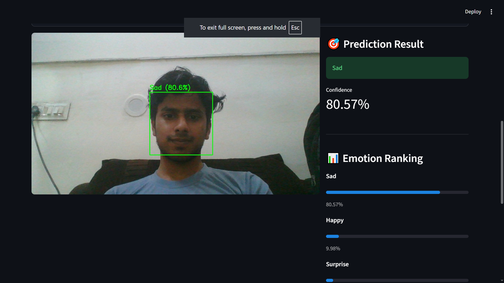
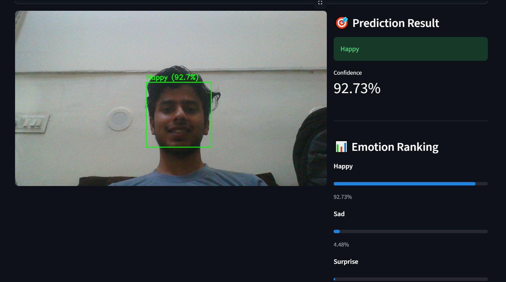

# 😊 MoodLens-AI

<div align="center">

# 😊 Emotion Detection AI

### AI-Powered Facial Emotion Recognition using Deep Learning, TensorFlow, OpenCV & Streamlit


</div>

---

## 🚀 Overview

Emotion Detection AI is a Deep Learning and Computer Vision project that detects human emotions from facial images.

The system uses a CNN (Convolutional Neural Network) trained on the FER2013 dataset and provides an interactive Streamlit web application for emotion analysis.

### ✨ Features

* 📸 Image Upload Emotion Detection
* 📷 Camera Capture Emotion Detection
* 😀 Facial Emotion Recognition
* 🎯 Confidence Score Prediction
* 📊 Emotion Ranking Visualization
* 🧠 CNN-based Deep Learning Model
* ⚡ Interactive Streamlit UI
* 👤 Automatic Face Detection

---

## 📸 Project Screenshots

### 🏠 Home Page



---

### 🎯 Emotion Detection Result



---

## 🎭 Supported Emotions

| Emotion     |
| ----------- |
| 😠 Angry    |
| 🤢 Disgust  |
| 😨 Fear     |
| 😊 Happy    |
| 😢 Sad      |
| 😲 Surprise |
| 😐 Neutral  |

---

## 🏗️ Project Structure

```text
FACE-DETECTION
│
├── app/
│   └── Core Detection Scripts
│
├── UI/
│   └── Streamlit Web Application
│
├── model/
│   └── emotion_model.h5
│
├── notebook/
│   └── Training Notebook
│
├── ComputerVision_Cascade/
│   └── Haar Cascade XML
│
├── screenshot/
│   ├── image.png
│   └── image1.png
│
├── README.md
├── requirements.txt
└── .gitignore
```

---

## 🧠 Deep Learning Architecture

```text
Input (48x48x1)

↓ Conv2D (32 Filters)
↓ MaxPooling

↓ Conv2D (64 Filters)
↓ MaxPooling

↓ Conv2D (128 Filters)
↓ MaxPooling

↓ Flatten

↓ Dense (512 Neurons)

↓ Dropout (0.5)

↓ Dense (7 Classes)

Output → Emotion Prediction
```

---

## ⚙️ Technologies Used

### 🔥 Deep Learning

* TensorFlow
* Keras
* CNN (Convolutional Neural Network)

### 👁️ Computer Vision

* OpenCV
* Haar Cascade Face Detection

### 🎨 Frontend

* Streamlit

### 📊 Data Processing

* NumPy
* Pillow (PIL)

### 📈 Visualization

* Matplotlib

---

## 📂 Dataset

This project uses the FER2013 Facial Emotion Recognition Dataset.

Download Dataset:

https://www.kaggle.com/datasets/msambare/fer2013

Dataset is not included in this repository.

```text
data/
├── train/
└── test/
```

---

## 🔧 Installation

### Clone Repository

```bash
git clone https://github.com/yourusername/MoodLens-AI.git

cd MoodLens-AI
```

### Create Virtual Environment

```bash
python -m venv env
```

### Activate Environment

Windows:

```bash
env\Scripts\activate
```

Linux / Mac:

```bash
source env/bin/activate
```

### Install Dependencies

```bash
pip install -r requirements.txt
```

---

## ▶️ Run Application

```bash
streamlit run UI/ui.py
```

Application will start at:

```text
http://localhost:8501
```

---

## 🎯 How It Works

1. Upload an image or capture a photo using the camera.
2. OpenCV detects faces in the image.
3. Face region is converted to grayscale.
4. Image is resized to 48×48 pixels.
5. CNN model predicts the emotion.
6. Emotion label and confidence score are displayed.
7. Results are visualized through the Streamlit UI.

---

## 📊 Example Output

```text
Happy (92.3%)

Emotion Ranking:

Happy      92.3%
Neutral     4.1%
Surprise    1.8%
Sad         0.9%
Fear        0.5%
Angry       0.3%
Disgust     0.1%
```

---

## 🌟 Future Improvements

* 🎥 Real-Time Webcam Streaming
* 📊 Emotion Analytics Dashboard
* 📈 Emotion Trends Visualization
* ☁️ Cloud Deployment
* 📱 Mobile-Friendly Interface
* 🤖 Multiple Face Tracking

---

## 👨‍💻 Author

### Akash Patel

Passionate about:

* Artificial Intelligence
* Deep Learning
* Computer Vision
* Machine Learning
* Generative AI

---

## ⭐ Support

If you found this project useful:

⭐ Star the repository

🍴 Fork the project

📢 Share your feedback

---

<div align="center">

### 🚀 Teaching Machines to Understand Human Emotions

Made with ❤️ using Deep Learning, OpenCV & TensorFlow

</div>
